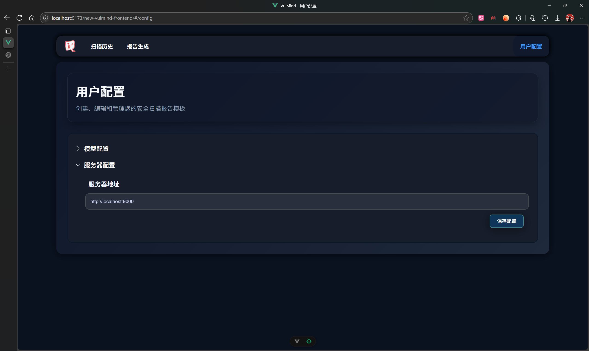

# vulmind-frontend

This template should help get you started developing with Vue 3 in Vite.

## Recommended IDE Setup

[VSCode](https://code.visualstudio.com/) + [Volar](https://marketplace.visualstudio.com/items?itemName=Vue.volar) (and disable Vetur).

## Customize configuration

See [Vite Configuration Reference](https://vite.dev/config/).

## Project Setup

```sh
npm install
```

### Compile and Hot-Reload for Development

```sh
npm run dev
```

### Compile and Minify for Production

```sh
npm run build
```

# 前端连接

运行app.py后端地址可以填写在用户配置上进行连接。



运行app.py后端地址可以填写在数据服务器上进行连接。

运行main.py后端地址可以填写在MCP配置上进行连接。（仅为模拟，具体后端可查看相关项目）
